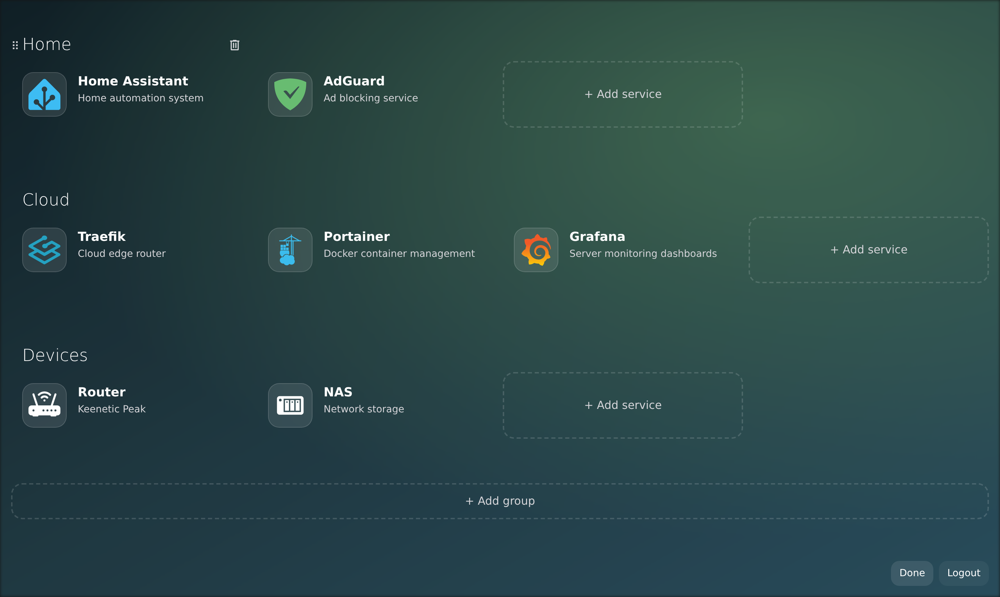
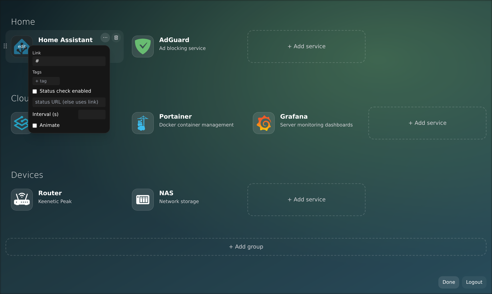
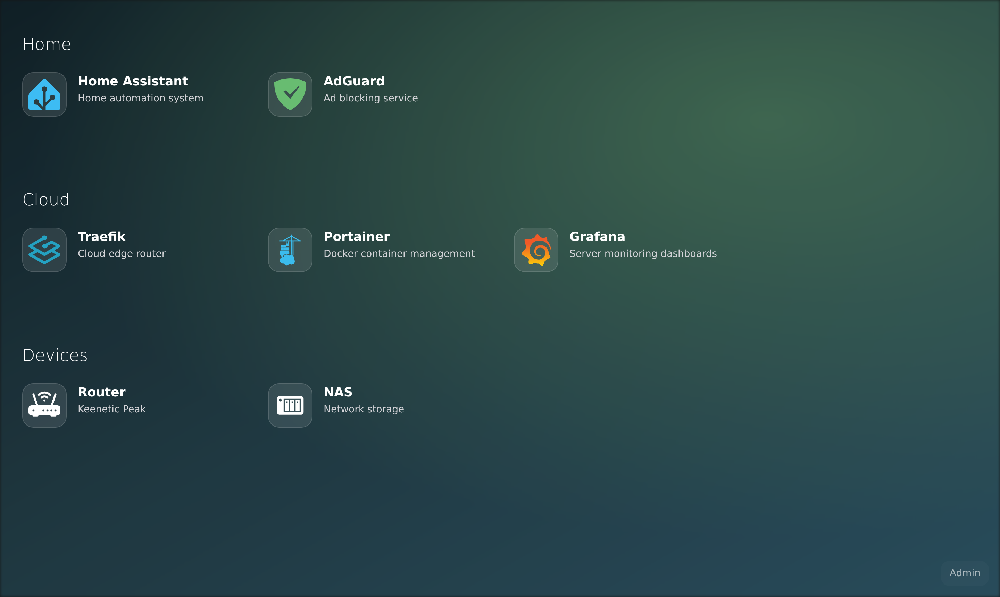

# Mafl — `be-nj` fork

Upstream [hywax/mafl](https://github.com/hywax/mafl) `main`, plus a browser-based editor and four open upstream PRs, in one drop-in image. Same `config.yml`, nothing to migrate.

```yaml
services:
  mafl:
    image: ghcr.io/be-nj/mafl:integration # amd64; per-commit tags: integration-<sha>
```

**Edit the dashboard in the browser** — admin-only, and off entirely unless you configure auth

* Rename services and edit descriptions and links in place
* Set icons by Iconify name, by URL, or upload your own image
* Edit tags, per-card status checks, and write-only API keys
* Add, delete and drag services between groups
* Add, rename, reorder and delete groups
* Saves instantly; every open browser updates itself
* Enable with a shared admin token, or with the group header your forward-auth proxy (Authentik, Authelia, oauth2-proxy, …) already sends

**Backported from open upstream PRs**

* Background images from `data/backgrounds/` or an external `url`, with `opacity` and `blur` — [#188](https://github.com/hywax/mafl/pull/188)
* Icons from a mounted folder, served at `/icons/…` — no image rebuild to add a logo — [#190](https://github.com/hywax/mafl/pull/190)
* `status.url` separate from the link you click — [#192](https://github.com/hywax/mafl/pull/192)
* Non-square icons keep their aspect ratio instead of being squashed — [#193](https://github.com/hywax/mafl/pull/193)

> [!NOTE]
> Saving from the editor rewrites the whole `config.yml`, which drops any comments in it. Once the four PRs land upstream, switch back to the official `hywax/mafl` image.

<p align="center">
  
  <br/><em>Edit mode — add, drag and delete services and groups in place</em>
  <br/><br/>
  
  
  <br/><em>Per-card settings (link, tags, status URL, secrets) · a custom background image</em>
</p>

Short version: [WHATS-NEW.md](./WHATS-NEW.md) · Full detail and security notes: [CHANGELOG-FORK.md](./CHANGELOG-FORK.md)

---

<h1 align="center">Mafl</h1>
<p align="center">
  <i>Mafl is an intuitive service for organizing your homepage. Customize Mafl to your individual needs and work even more efficiently!</i>
  <br/><br/>
  
  <br/><br/>
  <b><a href="https://mafl.hywax.space/community/showcase.html">User Showcase</a></b> | <b><a href="https://mafl.hywax.space">Documentation</a></b> | <b><a href="https://github.com/hywax/mafl">GitHub</a></b>
  <br/><br/>
  <a href="https://github.com/hywax/mafl/blob/main/CHANGELOG.md"></a>
  <a target="_blank" href="https://github.com/hywax/mafl"></a>
  <a target="_blank" href="https://hub.docker.com/r/hywax/mafl"></a>
  <a href="https://github.com/hywax/mafl/blob/main/LICENSE"></a>
  <br/><br/>
  
</p>

<details>
  <summary><b>Table of Contents</b></summary>

* [Features](#-features)
* [Getting started](#-getting-started)
  * [Docker](#docker)
  * [Node](#node)
  * [Proxmox](#proxmox)
* [Services](#-services)
* [Themes](#-themes)
* [Icons](#-icons)
* [Languages](#-multi-language)
* [Credits](#-credits)
  * [Contributors](#contributors)
* [License](#-license)
</details>

## 🎯 Features

* 🔐 **Privacy**. All requests to third-party services occur in backend.
* ⚡ **Real-time**. Interactive cards with extra information.
* 🌎 **Multi-language**. Supports multiple languages.
* 🎨 **Themes**. Customize the look to your liking.
* 🗂️ **Grouping**. Create custom service groups.
* 🏷️ **Tags**. Add tags to your services.
* 👌 **Easy setup**. A few lines of yaml and your homepage is ready to go.
* 🚀 **Fast**. Everything is fast and free of hang-ups.
* 🐳 **Docker**. Optimized docker images for popular platforms.
* ✨ **Free**. Mafl is completely free and open source.
* 📲 **PWA**. Installable application.

## 🚀 Getting started

### Docker

This Docker image is published to both Docker Hub and the GitHub container registry. Depending on your preferences and needs, you can reference both `hywax/mafl` as well as `ghcr.io/hywax/mafl`.

```yaml
version: '3.8'

services:
  mafl:
    image: hywax/mafl
    restart: unless-stopped
    ports:
      - '3000:3000'
    volumes:
      - ./mafl/:/app/data/
```

### Node

First, clone the repository:

```shell
git clone https://github.com/hywax/mafl.git
```

Then install dependencies and build the production bundle (I'm using `yarn` here, you can use `npm` or `pnpm` if you like):

```shell
yarn install
yarn build
```

Finally, run the server:

```shell
yarn preview
```

The application will start with a basic configuration, which is located in the `data` folder.

### Proxmox

To create a new Proxmox VE Mafl LXC, run the command below in the Proxmox VE Shell.

```shell
bash -c "$(wget -qLO - https://github.com/community-scripts/ProxmoxVE/raw/main/ct/mafl.sh)"
```

Configure the application by editing the `config.yml` file:

```shell
nano /opt/mafl/data/config.yml
```

Many thanks to [@tteck](https://github.com/tteck) for helping me create lxc script.

## 📊 Services

The basic concept of `Mafl` is to create not just a homepage, but to create an interactive homepage page. You can combine different services with each other. You can combine different services to create the perfect customized homepage for you.

List of services:
* **[Base](https://mafl.hywax.space/services/base.html)** - The main card of the service. Other services are created on the basis of this service.
* **[IP API](https://mafl.hywax.space/services/ip-api.html)** - Shows information about your IP address.
* **[Weather](https://mafl.hywax.space/services/openweathermap.html)** - Shows weather information for your location.

## 🎨 Themes

There are several ready-made themes in `Mafl`. But nothing prevents you from creating your own design themes and sharing them with other users


## 🖼 Icons

Services can have icons. With support for several different icon packs, you can find the perfect thumbnail for any application or service.

Supported types:
* **[Iconify](https://icon-sets.iconify.design/)** - Over 200,000 open source vector icons
* **Emoji** - Any valid emoji can be used as an icon
* **URL** - Pass the URL of any matching image so that it can be found and displayed.
* **Local** - Store custom images locally and reference them by file name

## 🌎 Multi-language

`Mafl` supports multiple languages and locales. The app should automatically detect your language and set it in the settings. If not, set it in `config.yml` with the `lang` property.

Supported Languages:
* 🇬🇧 **English** - `en`
* 🇷🇺 **Russian** - `ru`
* 🇨🇳 **Chinese** - `zh`
* 🇨🇮 **Hindi** - `hi`
* 🇪🇸 **Spanish** - `es`
* 🇸🇦 **Arabic** - `ar` (by [@mohmadhabib](https://github.com/mohmadhabib))
* 🇵🇱 **Polish** - `pl` (by [@UberDudePL](https://github.com/UberDudePL))
* 🇫🇷 **France** - `fr` (by [@maxim31cote](https://github.com/maxim31cote))
* 🇩🇪 **German** - `de` (by [@gehno](https://github.com/gehno))
* 🇬🇷 **Greek** - `gr` (by [@sthivaios](https://github.com/sthivaios))

If you haven't found your language, it can easily be added! Use the instructions in the section [contributing](https://mafl.hywax.space/community/contributing.html) on docs.

## 🏆 Credits

A huge thank you to everyone who is helping to improve Mafl. Thanks to you, the project can evolve!

### Contributors

To become a contributor, please follow our [contributing guide](https://mafl.hywax.space/community/contributing.html).


## 📄 License

This app is open-sourced software licensed under the [MIT license](https://github.com/hywax/mafl/blob/main/LICENSE).
